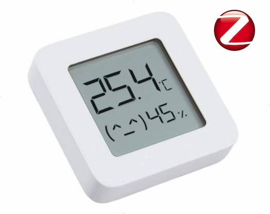

# Zigbee 3.0 Firmware for original LYWSD03MMC Sensor

This repository contains the Zigbee firmware for Xiaomi LYWSD03MMC Bluetooth temperature and humidity sensor.

## Overview



The LYWSD03MMC is a Bluetooth temperature and humidity sensor that can be integrated into a Zigbee network using
this firmware. This repository hosts the code and related resources to flash the device and make 
it compatible with Zigbee networks.

## Features
- Full-featured firmware to convert Xiaomi LYWSD03MC device with default ZCL battery, temperature and relative humidity clusters
- Display support for known revisions
- OTA support in firmware and binaries in ZCL format for update 
- Flashable over-the-air from custom ATC firmware https://devbis.github.io/telink-zigbee/
- Flashable over SWS-UART interface using one of:

  - https://pvvx.github.io/ATC_MiThermometer/USBCOMFlashTx.html
  - https://github.com/devbis/z03mmc/blob/master/TLSR825xComFlasher.py

## Getting Started

### Prerequisites

- Zigbee compatible hardware (e.g., Zigbee coordinator or gateway).
- Necessary tools for flashing firmware to the sensor.

### Prebuild firmware

You can download binaries from releases: https://github.com/devbis/z03mmc/releases

You may also want to compile it yourself, the instruction is below.

## Flashing over the air (easy way)
1. Open an awesome tool from ATC_MiThermometer https://devbis.github.io/telink-zigbee/
2. Click "Connect" button and find device LYWSD03MMC, wait for connection (Connected in logs)
3. On a new device with stock firmware click "Do Activation" and wait some time.
4. Next "Select Firmware", choose file with the transitional firmware [ATC_ota_400000](./assets/ATC_ota_40000.bin), click "Start Flashing". This step is required even if you already installed a custom bluetooth firmware. Not flashing this file will likely cause your device to get bricked and require flashing via USB/UART!
5. You will see in logs "Update done after NN seconds"
6. Connect to the device again (with name ATC_802190 or similar, based on mac-address). If it doesn't appear, remove and reinsert the battery and refresh the webpage with the flashing tool.
7. Flash the latest [z03mmc.bin](https://github.com/devbis/z03mmc/releases) firmware over transitional firmware to convert it to zigbee.
8. The device should now show up in your Zigbee bridge (If joining is enabled, of course). If it doesn't, reinsert the battery and/or short the RESET and GND contacts on the board for 5 seconds.

## Flashing firmware with USB to UART

### Prerequisites: 
1. TTL-USB adaptor
2. 1k-1.8k Ohm resistor
3. python3 with pyserial module installed


To flash a new firmware via an standard USB to UART adapter, simply connect the Thermometer as seen in the picture [Mi_SWS_Connection.jpg](./assets/Mi_SWS_Connection.jpg) to the USB to UART converter and run the TLSR825xComFlasher.py tool.

Example: `python3 TLSR825xComFlasher.py -p COM3 wf 0 z03mmc.bin`

Example: `python3 TLSR825xComFlasher.py -p /dev/ttyUSB0 wf 0 z03mmc.bin`

In case if the SWS pin is used by the firmware, try this sequence:
1. Power off the sensor
2. `python3 TLSR825xComFlasher.py -p <YOUR_COM_PORT> -t5000 wf 0 z03mmc.bin`
3. Now you have 5 seconds to power on the sensor
4. In case the chip has not started being flashed, run `python3 TLSR825xComFlasher.py -p <YOUR_COM_PORT> wf 0 z03mmc.bin` without the timeout again.
   
   If the flashing fails reduce baud rate down to 340000 or increase timeouts in the script.

5. If you flashed the module but the screen is remaining blank, try `python3 TLSR825xComFlasher.py -p <YOUR_COM_PORT> ea` to erase all flash and then write the firmware again.

The UART flasher software uses the tool from https://github.com/pvvx/ATC_MiThermometer. Thanks to pvvx for the awesome work on this!

## Compatibility list

- Zigbee2mqtt: works without custom converter since 1.33.2, OTA is supported
- ZHA: works without quirks, OTA update is supported
- HOMEd: works, OTA update is supported
- TuYa: it is reported device can connect to some hubs/gateways and visible with Smart Life app, values are rounded to integers, OTA is not supported
- MiHome: does not work
- Yandex Hub/Station: works, OTA is not available
- deCONZ/Phoscon App: not supported (need to add the device to its database?)

## Return to Bluetooth firmware

1. You can use Zigbee OTA to flash [1141-0203-99993001-ATC_v46.zigbee](./assets/1141-0203-99993001-ATC_v46.zigbee). See [zigbee2mqtt local OTA index](https://www.zigbee2mqtt.io/guide/usage/ota_updates.html#local-ota-index-and-firmware-files) or [ZHA OTA folder](https://github.com/zigpy/zigpy/wiki/OTA-Device-Firmware-Updates)
2. Using UART dongle, use .bin firmware you like, either original or custom from https://github.com/pvvx/ATC_MiThermometer

## Zigbee OTA upgrades

The already flashed firmware supports OTA zigbee upgrade via standard flow.
See zigbee2mqtt, ZHA, and HOMEd documentation for details.


## Configuring the device

Migrated device is fully compatible with ZCL standards for zigbee devices. It reuses standard clusters where possible for Zigbee 3.0.

And to fine tune display and values, additional attributes are implemented:

* 0x0402 (Temperature)
    * Attribute: 0x0010: (signed) int16: temperature calibration. A value in 0.01ºC offset to fix up incorrect values from sensor.
* 0x0405 (Relative humidity)
    * Attribute: 0x0010: (signed) int16: humidity calibration. A value in 0.01% offset to fix up incorrect values from sensor.
* 0x0204 (Thermostat User Interface Configuration)
    * Attribute: 0x0010: boolean: smiley. 0 - smiley is off, 1 - smiley is on (according to comfort values below).
    * Attribute: 0x0011: boolean: display. 0 - display is off, 1 - display is on.
    * Attribute: 0x0102: (signed) int16: comfort temperature min: A value in 0.01ºC to set minimum comfort temperature for happy face. The default value is 2100.
    * Attribute: 0x0103: (signed) int16: comfort temperature max: A value in 0.01ºC to set maximum comfort temperature for happy face. The default value is 2600.
    * Attribute: 0x0104: uint16: comfort temperature min: A value in 0.01% to set minimum comfort humidity for happy face. The default value is 3000.
    * Attribute: 0x0105: uint16: comfort temperature max: A value in 0.01% to set maximum comfort humidity for happy face. The default value is 6000.

### Using ºF

You can switch to displaying temperature in degrees Fahrenheit by "pressing" reset-gnd for 1 second.
Or write 1 to 0x0204/0x0000 (Thermostat User Interface Configuration/TemperatureDisplayMode)

### Building firmware

1. Clone TC32 toolchain according to your host OS:
    ```sh
    git clone https://github.com/devbis/tc32.git -b linux
    ```
    ```sh
    git clone https://github.com/devbis/tc32.git -b macos
    ```
    ```sh
    git clone https://github.com/devbis/tc32.git -b windows
    ```

2. Clone this repository and SDK:

    ```sh
    git clone https://github.com/devbis/z03mmc.git
    git clone https://github.com/devbis/tl_zigbee_sdk.git -b 3.6.8.6 --depth 1
   
    cd z03mmc
    ```
   
3. Configure and build:
    ```sh
    cmake -B build -DSDK_PREFIX=$(pwd)/../tl_zigbee_sdk -DTOOLCHAIN_PREFIX=$(pwd)/../tc32 -DMANUFACTURER_CODE=0x1141
    cmake --build build --target z03mmc.zigbee
    ```

    Firmware binary is located at `build/src/z03mmc.bin`
    The binary with OTA header is at the same folder, ending with `z03mmc.zigbee`


## Related Work
z03mmc is based on the original work of @pvvx, and @atc1441, who developed the initial firmware versions for bluetooth-capable device.
- https://github.com/pvvx/ATC_MiThermometer
- https://github.com/atc1441/ATC_MiThermometer

## Usage

1. Flash the firmware
2. Enable pairing mode on Zigbee coordinator
3. In case it is not joining, close the RESET and GND contacts on the board for 3 seconds to reset Zigbee settings. Replug the battery may require
4. For zigbee2mqtt you need to add custom converter if you use version 1.33.1 or earlier

## License

This project is licensed under the GNU General Public License 3.0 or later - see the [LICENSE.txt](LICENSE.txt) file for details.
